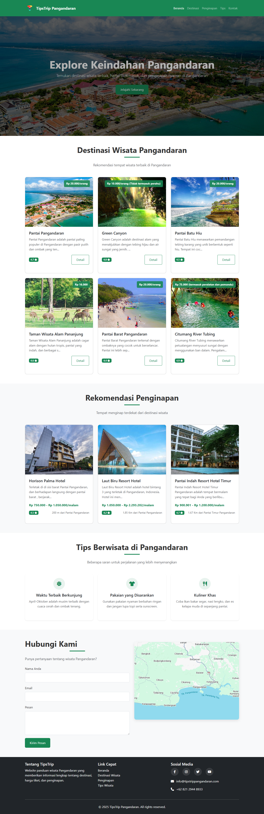

# TipsTrip - Panduan Wisata Pangandaran



Website rekomendasi tempat wisata di Pangandaran yang menampilkan informasi destinasi, harga tiket masuk, dan penginapan terdekat.

## Fitur Utama

✅ Daftar lengkap tempat wisata Pangandaran  
✅ Informasi harga tiket masuk terkini  
✅ Rekomendasi penginapan terdekat  
✅ Tips berwisata di Pangandaran  
✅ Tampilan responsif (desktop, tablet, mobile)  
✅ Sistem rating tempat wisata  

## Teknologi Yang Digunakan

- HTML5
- CSS3 (dengan Bootstrap 5)
- JavaScript
- [Font Awesome](https://fontawesome.com/) untuk ikon
- [Google Maps](https://maps.google.com/) embed

## Cara Menjalankan

1. Clone repository ini:
```bash
git clone https://github.com/aleaengineer/tipstrippangandaran.git
```

2. Buka file `index.html` di browser favorit Anda

## Kontribusi

Pull request dipersilakan. Untuk perubahan besar, buka issue terlebih dahulu untuk didiskusikan.

## Lisensi

[MIT](LICENSE)